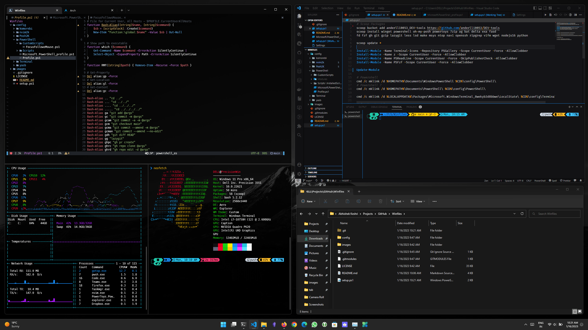

<div align = "center">

<h1><a href="https://github.com/2kabhishek/win2k">win2k</a></h1>

<a href="https://github.com/2KAbhishek/win2k/blob/main/LICENSE">
 </a>

<a href="https://github.com/2KAbhishek/win2k/graphs/contributors">
 </a>

<a href="https://github.com/2KAbhishek/win2k/stargazers">
</a>

<a href="https://github.com/2KAbhishek/win2k/network/members">
 </a>

<a href="https://github.com/2KAbhishek/win2k/watchers">
 </a>

<a href="https://github.com/2KAbhishek/win2k/pulse">
 </a>

<h3>Ultimate Dev Setup for Windows 🪟🪄</h3>

<figure>
  
  <br/>
  <figcaption>win2k in action</figcaption>
</figure>

</div>

win2k is a set of handcrafted configs for setting up a complete dev environment on Windows.

It makes developing on Windows much more pleasant for CLI lovers.

## ✨ Features

- Can set up a complete dev environment within minutes
- Full featured CLI dev environment on Windows (natively, without WSL!)
- Powerful personalized editing with [nvim2k](https://github.com/2kabhishek/nvim2k)
- Shiny and extensible prompt with [oh-my-posh](https://ohmyposh.dev/) and [Posh2K](https://github.com/2kabhishek/Posh2K)
- Modern and intuitive keybindings for Windows inspired by [tmux-tilit](https://github.com/2kabhishek/tmux-tilit)
- Tiling window management with [komorebi](https://github.com/LGUG2Z/komorebi) and [whkd](https://github.com/LGUG2Z/whkd)
- Statusbar support with [yasb](https://github.com/denBot/yasb)
- More!!

## Setup

### ⚡ Requirements

- Powershell >= 7 (recommended), Most features should work on Powershell 1.0
- [scoop](https://scoop.sh/) — for package management
- [Meslo Nerd Font](https://github.com/ryanoasis/nerd-fonts/blob/master/patched-fonts/Meslo/S-DZ/Regular/complete/Meslo%20LG%20S%20DZ%20Regular%20Nerd%20Font%20Complete.ttf) — Recommended font for glyphs support

### 🚀 Installation

- Enable remote script execution (Only needed one time)
```powershell
Set-ExecutionPolicy -ExecutionPolicy RemoteSigned -Scope CurrentUser
```
- Install scoop
```powershell
Invoke-RestMethod -Uri https://get.scoop.sh | Invoke-Expression
```
- Install git (7zip and aria2 to help with scoop installations) if you haven't already
```powershell
scoop install aria2 7zip git
```
- Clone win2k
```powershell
git clone --recurse-submodules https://github.com/2kabhishek/win2k
```
- Run setup (Recommended to run in Admin mode)
```powershell
cd win2k
.\setup.ps1
```

This will install all necessary packages, modules and setup symlinks for you.

If setup runs into errors, try running the command in an admin mode or run the command from `setup.ps1` manually.

### 💻 Usage

#### Tiling

Tiling is disabled by default as AutoHotKey keybindings are somewhat buggy.

But if you want to use Tiling Window Manager without keybindings:

Run `StartTiling`/`StopTiling` on a Powershell prompt to control tiling.

I recommend using PowerTools to add some keybindings, for example:

- <kbd>Win</kbd> + <kbd>q</kbd> for closing current window

#### Status Bar

You can use yasb to show a status bar, similar to polybar.
Follow instructions on [yasb](https://github.com/denBot/yasb) to set up.

My yasb configs are [here](https://github.com/2KAbhishek/win2k/tree/main/config/yasb)

#### Extra Fonts

If you want to try out other fonts, you can also use oh-my-posh to install fonts

Just run `oh-my-posh font install` and select the font of your choice.

#### More Tools

I have intentionally kept the default list of packages to bare essentials.

If you want any other tools you can install them with scoop or winget.

```powershell
# Install VS Code
scoop install code
# Install winget
scoop install winget
```

You can also search for packages using `scoop search name`.

#### Other Configs

For most tools I'm symlinking configs over from my main [dots2k](https://github.com/2kabhishek/dots2k).

You can do the same or plugin your own.

## Behind The Code

### 🌈 Inspiration

I find working on Windows somewhat unpleasant, WSL although tries and fixes it, but it felt constrained.

That's why I decided to set up a dev environment using native windows tooling.

### 💡 Challenges/Learnings

- The main challenge was to figure out all the pieces of this puzzle and solving it.
- Learned a lot about Powershell and did quite some scripting with it.
- Learned more about the Windows ecosystem, different environment variables, configs etc.
- Had lots of fun!

### 🧰 Tooling

- [dots2k](https://github.com/2kabhishek/dots2k) — Dev Environment
- [nvim2k](https://github.com/2kabhishek/nvim2k) — Personalized Editor
- [qute2k](https://github.com/2kabhishek/qute2k) — Personalized Browser
- Powershell
- Windows Terminal

<hr>

<div align="center">

<strong>⭐ hit the star button if you found this useful ⭐</strong><br>

<a href="https://github.com/2KAbhishek/win2k">Source</a>
| <a href="https://2kabhishek.github.io/blog" target="_blank">Blog </a>
| <a href="https://twitter.com/2kabhishek" target="_blank">Twitter </a>
| <a href="https://linkedin.com/in/2kabhishek" target="_blank">LinkedIn </a>
| <a href="https://2kabhishek.github.io/links" target="_blank">More Links </a>
| <a href="https://2kabhishek.github.io/projects" target="_blank">Other Projects </a>

</div>
